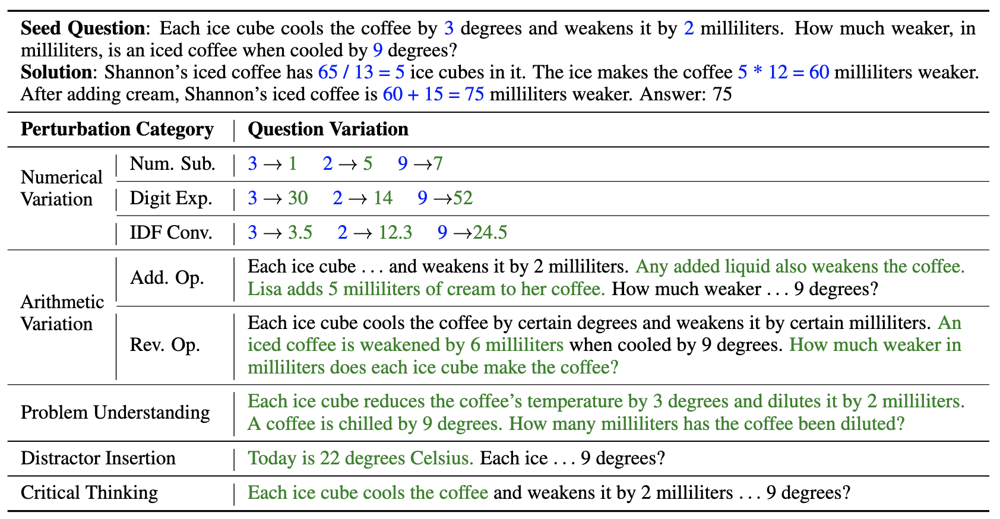

# GSM-Plus: Evaluating the Robustness of LLMs as Mathematical Problem Solvers

 


Dataset and Code for the Paper "[A Comprehensive Benchmark for Evaluating the Robustness of LLMs as Mathematical Problem Solvers](https://arxiv.org/abs/)".

<div align="center">
  <!-- <a href="#model">Model</a> • -->
  🌐 <a href="https://qtli.github.io/GSM-Plus">Project Page</a> |
  📚 <a href="https://huggingface.co/datasets/qintongli/GSM-Plus">Data</a> |
  📃 <a href="https://arxiv.org/abs/2401.13178">Paper</a> |
</div>


## Introduction

Large language models (LLMs) have achieved impressive performance across various mathematical reasoning benchmarks. 
However, there are increasing debates regarding whether these models truly understand and apply mathematical knowledge or merely rely on shortcuts for mathematical reasoning. 
One essential and frequently occurring evidence is that when the math questions are slightly changed, LLMs can behave incorrectly.

In response to these issues, we present GSM-Plus, an adversarial evaluation benchmark that is crafted for systematically evaluating the mathematical reasoning capability of LLMs. 
we identify 5 perspectives to guide the development of GSM-Plus: 
1. **Numerical Variation** refers to altering the numerical data or its types, including 3 subcategories: **numerical substitution**, **digit expansion**, and **integer-decimal-fraction conversion**.
2. **Arithmetic Variation** refers to reversing or introducing additional operations (e.g., addition, subtraction, multiplication, and division) to math problems, including 2 subcategories: **adding operation** and **reversing operation**.
3. **Problem Understanding** refers to rephrasing the text description of the math problems.
4. **Distractor Insertion** refers to inserting topic-related but useless sentences to the problems.
5. **Critical Thinking** focuses on question or doubt ability when the question lacks necessary statements. 

Based on the 1,319 test questions from GSM8K, we create eight variations for each question, the yielding GSM-Plus comprises **10,552** question variations.

## What's New
- **[2024.02.25]** 📣 Dataset is released.

## Dataset Example

Examples of eight adversarial questions based on a seed question:

<p align="center">
     <br>
</p>

## Dataset Usage

### Data Downloading

You can download GSM-Plus test set by the following command (make sure that you have installed [Huggingface Datasets](https://huggingface.co/docs/datasets/quickstart)):

```python
from datasets import load_dataset

dataset = load_dataset("qintongli/GSM-Plus")
# print the first example
print(dataset["test"][0])
```

The dataset is provided in `.jsonl` format and contains the following attributes:

```
{
    "question": the adversarial question,
    "solution": the solution chain for the adversarial question ,
    "answer": the gold answer of the adversarial question,
    "perturbation_type": the perturbation type,
    "seed_question": the seed question used to craft the adversarial question,
    "seed_solution": the solution chain for the seed question,
    "seed_answer": the gold answer of the seed question,
}
```

## Evaluations on GSM-Plus

### Usage Examples

We offer a few examples for evaluating LLMs on GSM-Plus, as follows:

- GPT-4, GPT-Turbo-3.5

```
python scripts/openai_model_inference.py --model_name [MODEL_NAME] --output_file [OUTPUT_PATH]/[MODEL_NAME]_prediction.json --prompt_type [PROMPT]
# [MODEL_NAME] can be: gpt-4-0613, gpt-3.5-turbo-0613, etc.
# [PROMPT] can be: cot, pot, ltm, complex, contrastive, cot_sc
```

- Mistral, LLaMA, CodeLlama

```
python scripts/general_model_inference.py \
--model_name [MODEL_NAME] \
--output_file [OUTPUT_PATH]/[MODEL_NAME]_prediction.json \
--model_dir [MODEL_PATH] \  # path to checkpoint files
--nshots 8 \
--prompt_type [PROMPT] \
--specify_your_gpus [GPUT_IDs]

# [PROMPT] can be: cot-nshot, pot-nshot, ltm-nshot, ltm-1shot, complex, contrastive
```

## Compositional Prompting

Extract key premise from a math word problem:

```
python scripts/extract_key_premise.py --outut_file comp_test.json --start_idx 0 --end_idx 10
```

Iteratively generate each reasoning thought based on the problem and its premise:

```
python scripts/compositional_prompt.py --input_file comp_test.json --output_file comp_prediction.json --goal_mode greedy --cal_mode greedy
```

## ️Citation
If you find **GSM-Plus** useful, please consider giving star and citing our paper:
```
@misc{ma2024agentboard,
      title={GSM-Plus: A Comprehensive Benchmark for Evaluating the Robustness of LLMs as Mathematical Problem Solvers}, 
      author={Qintong Li and Leyang Cui and Xueliang Zhao and Lingpeng Kong and Wei Bi},
      year={2024},
      eprint={},
      archivePrefix={arXiv},
      primaryClass={cs.CL}
}
```

